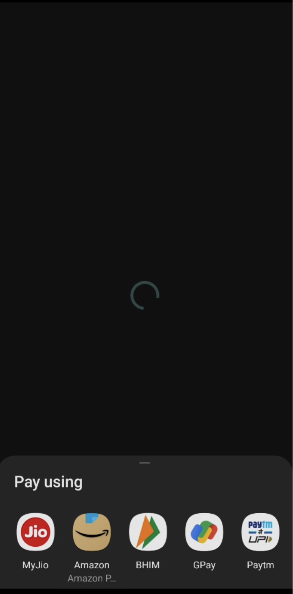

# easy_upi_payment

<p align="center">
  <a href="https://pub.dev/packages/easy_upi_payment">
    
  </a>
  <a href="https://twitter.com/gjj2019">
    
  </a>
  <a href="https://opensource.org/licenses/MIT"></a>
</p>

A new flutter plugin to make upi payment easily (only on Android).

# Screenshot

[Download Easy Upi Payment Apk](https://github.com/GJJ2019/easy_upi_payment/raw/main/example/assets/app-release.apk)



# System requirements

- Flutter: >= 2.5.0
- Dart: >=2.17.5 <3.0.0
- Android: min sdk 19

# Getting started

Add the plugin package to the `pubspec.yaml` file in your project:

```yaml
dependencies:
  easy_upi_payment: ^0.1.0
```

Install the new dependency:

```sh
flutter pub get
```

now go to `android/app/build.gradle` & add following lines

```diff
    defaultConfig {
-       minSdkVersion flutter.minSdkVersion
+       minSdkVersion 19
    }

    dependencies {
+       implementation "dev.shreyaspatil.EasyUpiPayment:EasyUpiPayment:3.0.3"
    }
```

# Usage

```dart
    final res = await EasyUpiPaymentPlatform.instance.startPayment(
      EasyUpiPaymentModel(
          payeeVpa: 'gaurav.jajoo@upi',
          payeeName: 'Gaurav Jajoo',
          amount: 10.0,
          description: 'Testing payment',
        ),
      );
      // TODO: add your success logic here
      print(res);
    } on EasyUpiPaymentException {
      // TODO: add your exception logic here
    }

```

for more details see [example](https://github.com/GJJ2019/easy_upi_payment/tree/main/example)

### Note: its uses third party android package [EasyUpiPayment-Android](https://github.com/PatilShreyas/EasyUpiPayment-Android)

# License

    MIT License

    Copyright (c) 2022 GJJ2019

    Permission is hereby granted, free of charge, to any person obtaining a copy
    of this software and associated documentation files (the "Software"), to deal
    in the Software without restriction, including without limitation the rights
    to use, copy, modify, merge, publish, distribute, sublicense, and/or sell
    copies of the Software, and to permit persons to whom the Software is
    furnished to do so, subject to the following conditions:
    
    The above copyright notice and this permission notice shall be included in all
    copies or substantial portions of the Software.
    
    THE SOFTWARE IS PROVIDED "AS IS", WITHOUT WARRANTY OF ANY KIND, EXPRESS OR
    IMPLIED, INCLUDING BUT NOT LIMITED TO THE WARRANTIES OF MERCHANTABILITY,
    FITNESS FOR A PARTICULAR PURPOSE AND NONINFRINGEMENT. IN NO EVENT SHALL THE
    AUTHORS OR COPYRIGHT HOLDERS BE LIABLE FOR ANY CLAIM, DAMAGES OR OTHER
    LIABILITY, WHETHER IN AN ACTION OF CONTRACT, TORT OR OTHERWISE, ARISING FROM,
    OUT OF OR IN CONNECTION WITH THE SOFTWARE OR THE USE OR OTHER DEALINGS IN THE
    SOFTWARE.
